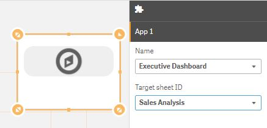
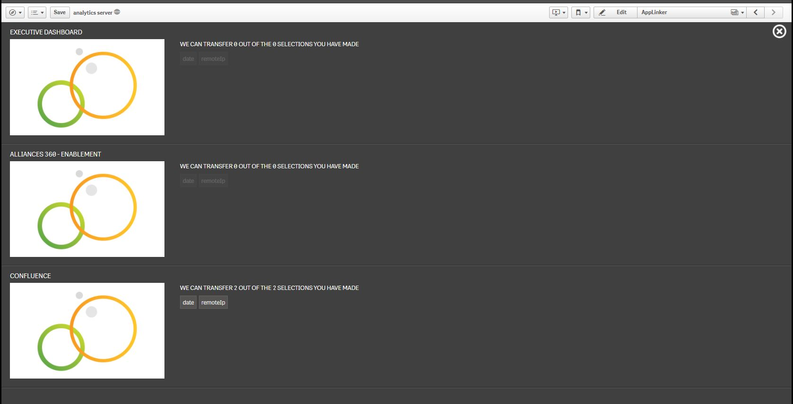

# Qlik Sense Extension App Linker

App Linker is an extension for Qlik Sense that transfers selections between applications.

The motivation for this extension is that it is normal to have suites of apps in Qlik Sense that have fields in common. Currently, there is no built-in way in Qlik Sense of taking a selection from one app to another, other than manually. This feature is present in Qlik View and it was called "Document Chaining".

## How to use

You may transfer your selections by linking other applications in your Sense repository to the application in which you're working. This is, the first step when setting up the App Linker is to declare the **linked applications**.

You may link up to five applications, each identified by the name of the application and a sheet within the app. In order to add a new app to the list of linked apps, go into edit mode and click on the App Linker object, which you should have dragged into the sheet you're working on:

Once a pair (*appName*, *sheetName*) has been selected using the dropdowns, you are ready to transfer your current selections to that application.

### Transferring your selections

Once you have a set of selections you want to transfer to another app, click on the App Linker icon. The *stage view* will be opened.

Please bear in mind that the selected dimensions need to have the exact same name in the origin and target app. Otherwise the extension won't be able to know that these dimensions are equivalent.

Once in this view, you will see a list with linked applications. Within each of the section corresponding to an app, you may see the fields in your current selection that can be transferred to the given application.

In order to open an application while transferring your current selection -if it is possible to do so-, click on the miniature of the app. In the case that you click on the miniature of an application to which no selections can be transferred, the application will be opened normally and the extension will not attempt to make the selections.

# Contributing

1. Fork it!
2. Create your feature branch: `git checkout -b my-new-feature`
3. Commit your changes: `git commit -am 'Add some feature'`
4. Push to the branch: `git push origin my-new-feature`
5. Submit a pull request :D

# License

Copyright © 2017 Analytics Operations

Released under the MIT license.

***
